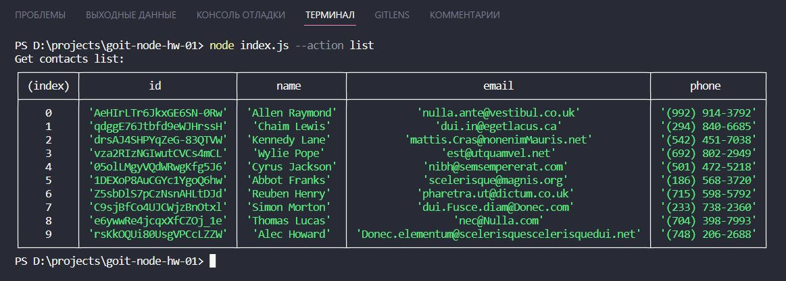
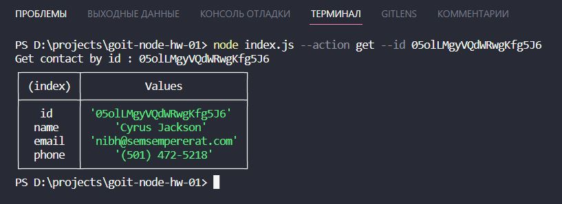
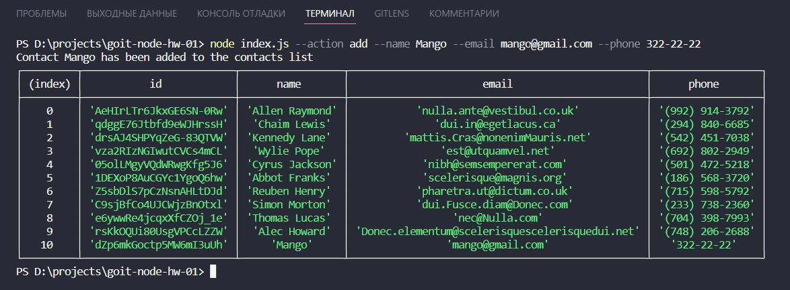
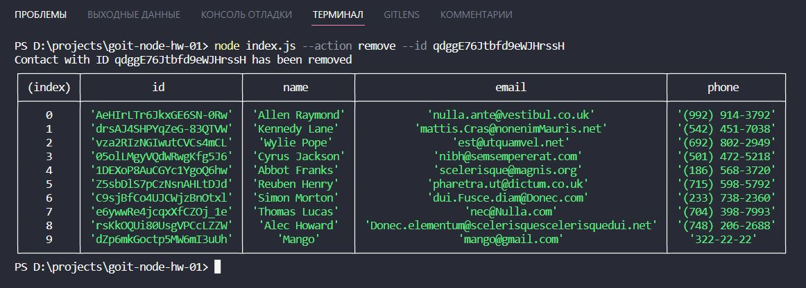

# Lesson 1: The Basics of Node.js

## :white_check_mark: We get a list of contacts and display it in the console in the form of a table.

## :white_check_mark: We display the information about the contact with the corresponding identifier in the form of a table in the console.

### If the contact is not found, the message "Contact with ID not found" will be displayed. If the contact is found, its information will be displayed.

## :white_check_mark: A new contact is added to the list of contacts and the entire list of contacts is displayed in the console in the form of a table.

## :white_check_mark: The contact is removed from the list of contacts by its identifier and the entire list of contacts is displayed in the console in the form of a table.

